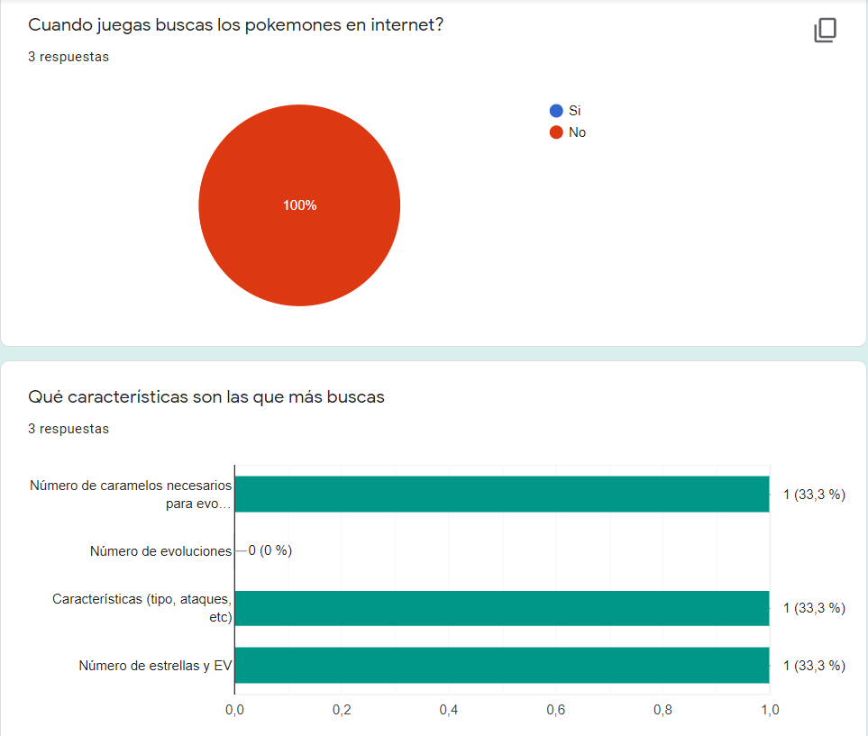

# Data Lovers

Plataforma Web de filtrado y visualización de información.
 

Vista: Plataforma Web.

 

Vista: Dispositivo Móvil.

## El Proyecto

Se buscar crear una plataforma Web amigable e intuitiva que permita filtrar y visualizar la información en base a las necesidades del usuario.

**Duración:** 3 semanas.
 
**Métodos:** Investigación, Ideación, Wireframes, Prototipado, Creación y Testeo.
 
**Herramientas:** HTML, CSS y Java Script.

## Contexto

Pensando en todos los usuarios de Pokemón Go que les gusta capturar a los personajes para poder competir en torneos o simplemente coleccionarlos, se creó **POKE-SHOP** una plataforma Web/Móvil amistosa que permite a los usuarios adquirir el pokemón que deseen, sin importar el lugar o temporada en el que se encuentren.

## Proceso

## Usabilidad

